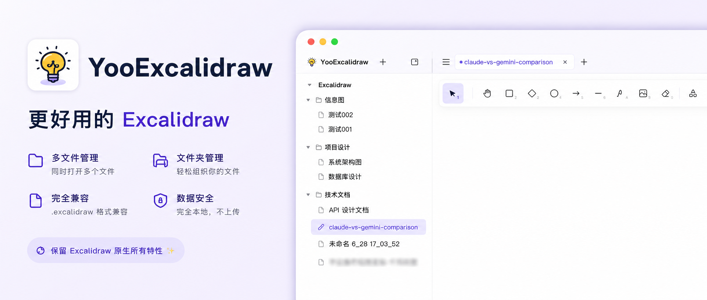
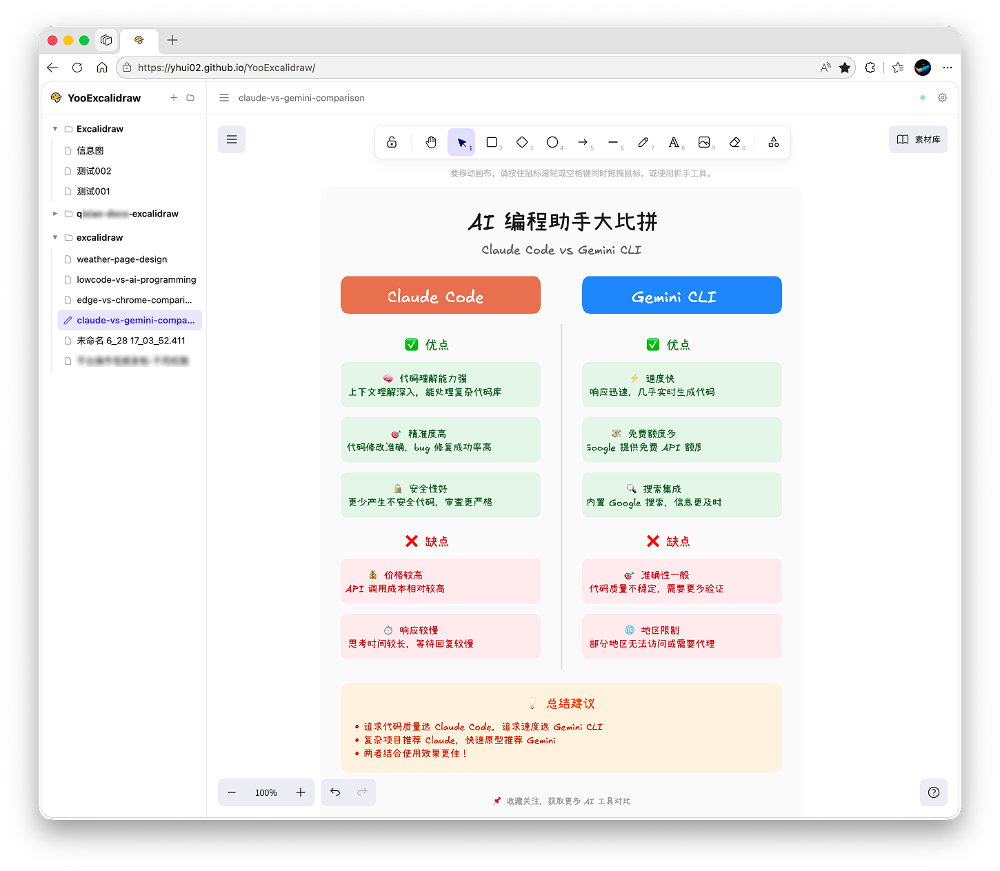

# YooExcalidraw

YooExcalidraw 是一个基于 Excalidraw 的本地画板管理工具，支持加载整个文件夹、在多文件间快速切换编辑，所有数据都存储在本地。



## 项目背景

Excalidraw 官方工具只能一次加载并修改一个文件，无法加载文件夹，也无法在多文件间快速切换。YooExcalidraw 解决了这些问题：

- **文件夹管理** — 直接加载整个文件夹，文件按目录自动分组
- **多文件切换** — 在文件夹内自由切换和编辑多个画板，数据实时读写到本地
- **本地存储** — 采用和官方同样的浏览器本地文件方案，不依赖后台，所有数据只存在你的电脑上

## 在线使用

部署在 GitHub Pages 上，无需安装，打开浏览器即可使用：

**[https://yhui02.github.io/YooExcalidraw](https://yhui02.github.io/YooExcalidraw)**

## 功能

- **文件夹管理** — 直接加载整个文件夹，文件按目录分组展示，支持同时管理多个目录
- **多文件支持** — 在文件夹内自由切换和编辑多个画板文件，切换时自动保存当前文件
- **本地存储** — 使用浏览器 File System Access API，数据只存在你的电脑上，不上传任何内容
- **自动保存** — 编辑后 1.5 秒自动保存到本地文件，也可手动 `Ctrl/Cmd + S` 保存
- **主题切换** — 支持跟随系统、浅色、深色三种模式
- **极简模式** — 顶部导航栏与左侧文件栏均可独立隐藏，获得与原版 Excalidraw 一致的沉浸体验
- **文件操作** — 新建、重命名（侧栏或导航栏双击）、删除、导出画板文件
- **拖放添加** — 拖拽文件夹到界面上即可添加目录
- **组件库导入** — 支持通过 URL 参数 `#addLibrary=<url>` 导入 [Excalidraw 官方组件库](https://libraries.excalidraw.com)，组件库数据随文件一起保存
- **多语言** — 支持 9 种语言：简体中文、繁體中文、English、日本語、한국어、Français、Deutsch、Español、Русский

## 浏览器兼容性

本工具依赖 [File System Access API](https://developer.chrome.com/docs/capabilities/web-apis/file-system-access)，仅在以下浏览器中可用：

| 浏览器 | 支持情况 | 最低版本 |
|---|---|---|
| Chrome | 支持 | 86+ |
| Edge | 支持 | 86+ |
| Opera | 支持 | 91+ |
| Firefox | 不支持 | — |
| Safari | 不支持 | — |
| Samsung Internet | 不支持 | — |

> Chrome 105+ 可获得完整的文件重命名支持（`FileSystemHandle.move()`）。

## 快速开始

```bash
pnpm install
pnpm dev
```

访问 `http://localhost:4321`，点击"选择文件夹"打开一个包含 `.excalidraw` 文件的本地目录即可开始使用。

## 技术栈

| 技术 | 用途 |
|---|---|
| [Astro](https://astro.build) v7 | 静态站点框架 |
| [React](https://react.dev) v19 | Excalidraw 编辑器组件 |
| [@excalidraw/excalidraw](https://github.com/excalidraw/excalidraw) v0.18 | 画板引擎 |
| [Tailwind CSS](https://tailwindcss.com) v4 + [daisyUI](https://daisyui.com) v5 | 样式 |
| [File System Access API](https://developer.chrome.com/docs/capabilities/web-apis/file-system-access) | 本地文件读写 |
| pnpm | 包管理 |

## 架构说明

应用为纯前端单页应用，无后端服务：

```
┌─────────────────────────────────────────────────────┐
│  index.astro (Vanilla JS)                           │
│  - 目录/文件管理（File System Access API）            │
│  - 自动保存、状态持久化（IndexedDB / localStorage）    │
│  - 设置、主题、语言、UI 交互                           │
│                                                     │
│  ┌───────────────────────────────────────────────┐  │
│  │  ExcalidrawWrapper.tsx (React)                │  │
│  │  - Excalidraw 编辑器实例管理                    │  │
│  │  - 场景加载/切换、视口记忆                       │  │
│  │  - 组件库导入与持久化                            │  │
│  └───────────────────────────────────────────────┘  │
└─────────────────────────────────────────────────────┘
         ↕ CustomEvent 事件总线通信
```

两者通过 `window` 上的自定义事件通信：

| 事件 | 方向 | 用途 |
|---|---|---|
| `excalidraw:ready` | React → Shell | 编辑器初始化完成 |
| `excalidraw:load` | Shell → React | 加载新场景 |
| `excalidraw:save-now` | 双向 | 触发立即保存 |
| `excalidraw:autosave` | React → Shell | 自动保存（防抖） |
| `excalidraw:dirty` | React → Shell | 画布有未保存修改 |
| `excalidraw:library-change` | React → Shell | 组件库变更 |
| `excalidraw:theme-changed` | Shell → React | 主题切换 |
| `excalidraw:settings-changed` | Shell → React | 设置变更 |
| `excalidraw:lang-changed` | Shell → React | 语言切换 |

## 开发

```bash
pnpm dev          # 启动开发服务器 (http://localhost:4321)
pnpm build        # 构建生产版本 → dist/
pnpm preview      # 预览生产构建
```


## 产品截图



## 开源协议

本项目采用 [Apache License 2.0](LICENSE)。
